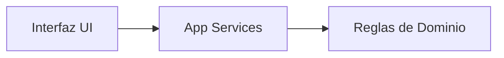

# 🗺️ Roadmap de Evolución del Proyecto

Este documento detalla la visión a futuro para transformar el **Anotador de Truco** de una herramienta local a una plataforma multijugador en tiempo real.

## 🎯 Visión General
El objetivo final es permitir que dos personas, cada una desde su propio dispositivo móvil, puedan sincronizar una partida de Truco en tiempo real, manteniendo la experiencia táctil de "arrastrar los fósforos".

---

## 📅 Fases del Desarrollo

### Fase 1: Consolidación UI & Lógica Local (Estado Actual)
- [x] Implementar Drag & Drop con GSAP.
- [x] Refactorización a Arquitectura Hexagonal y Limpieza de Código.
- [ ] **Motor de Reglas**: Implementar las reglas completas del Truco en `src/core/domain` (Flor, Envido, Truco, Validaciones de puntos).
- [ ] **Persistencia Local**: Guardar el estado de la partida en `localStorage` por si se recarga la página.

### Fase 2: Preparación para la Escalabilidad
- [ ] **State Management**: Introducir un gestor de estado global (ej. Zustand o XState) dentro de `core/application` para desacoplar totalmente el estado del juego de la vista. La vista solo debe "reaccionar" al estado.
- [ ] **Game Loop**: Refinar el bucle de juego para manejar turnos y eventos de manera secuencial.

### Fase 3: Backend & Sincronización (Multiplayer)
- [ ] **Backend Server**: Crear un servidor de alto rendimiento con **Bun** y **Hono**.
- [ ] **WebSockets**: Utilizar **WebSockets nativos de Bun** (vía Hono) para máxima velocidad.
    - Eventos: `matchstick_moved`, `points_added`, `game_reset`.
- [ ] **Rooms/Salas**: Lógica para crear salas de juego mediante códigos QR o enlaces compartibles.
- [ ] **Sincronización Optimista**: La UI se actualiza inmediatamente y se corrige si el servidor rechaza la acción (para evitar lag percibido).

### Fase 4: Experiencia Móvil & PWA
- [ ] **Touch Events**: Optimizar la sensibilidad de los fósforos en pantallas táctiles.
- [ ] **PWA (Progressive Web App)**: Permitir que la app se instale en el teléfono.
- [ ] **Haptics**: Agregar vibración al soltar un fósforo para feedback físico.

---

## 🏗️ Evolución de la Arquitectura

### 1. Estructura Actual (Cliente Monolítico)
Toda la lógica vive en el navegador del usuario.



### 2. Estructura Futura (Cliente-Servidor Sincronizado)
Migraremos a una arquitectura donde el "Dominio" es compartido o duplicado para validación, y el estado reside en el servidor.

```mermaid
graph TD
    ClientA[Cliente A (Móvil)] <-->|WebSocket| Server[Backend (Bun + Hono)]
    ClientB[Cliente B (Móvil)] <-->|WebSocket| Server
    
    subgraph "Cliente"
        UI --> ClientState[Gestor de Estado]
        ClientState --> UI
    end
    
    subgraph "Servidor"
        Server --> GameInstance[Instancia de Juego]
        GameInstance --> Rules[Reglas de Dominio]
    end
```

### 📂 Estructura de Carpetas (Proyección)

Cuando se implemente el backend, se sugiere una estructura de **Monorepo**:

```
/
├── packages/
│   ├── client/           # (El proyecto actual)
│   │   ├── src/ui/       # Componentes Visuales
│   │   └── src/store/    # Zustand/Redux (Cliente)
│   │
│   ├── server/           # Nuevo Backend
│   │   ├── src/gateway/  # WebSockets
│   │   └── src/game/     # Lógica de juego en servidor
│   │
│   └── shared/           # Código Compartido (Types, Enums, Reglas puras)
│       └── src/domain/   # Las reglas del truco (¡Reutilizables!)
```

## 🛠️ Tecnologías Futuras Sugeridas

| Componente | Tecnología Sugerida | Razón |
| :--- | :--- | :--- |
| **Backend** | **Bun + Hono** | Rendimiento superior, arranque instantáneo y simplicidad (Standard Web Objects). |
| **Transporte** | **Bun WebSockets** | Implementación nativa de bajo nivel, mucho más rápida que Socket.io. |
| **Estado Cliente** | **Zustand** | Ligero, simple y perfecto para gestionar estados de juego en React/Vanilla. |
| **Shared Code** | **PNPM Workspaces** | Para compartir las interfaces `ITrucoGame` entre front y back. |

---
_Este documento sirve como guía norte para las próximas iteraciones del proyecto._
