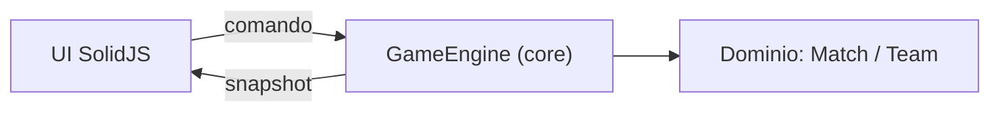
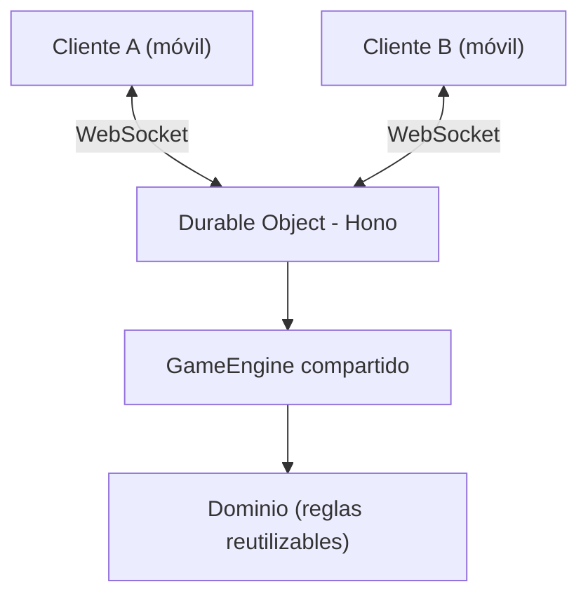

# 🗺️ Roadmap del Anotador de Truco

Este documento muestra **dónde estamos** y **qué queremos lograr**. Para la historia de *lo que ya
se hizo* (evolución de stacks según Git) ver [`HISTORIAL.md`](./HISTORIAL.md); para el detalle del
refactor hexagonal recién terminado ver [`plan.md`](./plan.md).

## 🎯 Visión

Transformar el anotador de un marcador táctil local a una **plataforma de Truco multijugador en
tiempo real**: dos personas, cada una en su dispositivo, sincronizando la misma partida, sin perder
la experiencia de "arrastrar los fósforos". El **core de reglas desacoplado** es la pieza que hace
esto posible: hoy corre en el navegador; mañana, el mismo core corre en el servidor.

---

## 📍 Estado actual — Junio 2026  ·  **← ESTÁS ACÁ**

Marcador local funcionando sobre **arquitectura hexagonal con el core como autoridad**.

- [x] UI en **SolidJS** con drag & drop de fósforos (**GSAP Draggable** + posicionamiento puro `gsap.to` sin Flip).
- [x] **Core hexagonal desacoplado** del framework:
  - [x] Dominio puro: `Match` / `Team`, puntos, **buenas/malas**, **límite 15/30**, ganador.
  - [x] `GameEngine` con API **comando-in / snapshot-out / subscribe** (contratos serializables).
  - [x] Adaptador SolidJS (`solidGameController`) que espeja el estado vía `reconcile`.
- [x] **La UI responde al core**: el drag despacha comandos (`sumarPunto`/`restarPunto`) y la vista
  refleja el snapshot del engine.
- [x] **Sin salto visual al animar**: fósforos siempre en el DOM del storage, posicionados con GSAP
  transforms; `createEffect` reactivo dispara la animación cuando cambia `zone`/`slotIndex`.
- [x] Tooling: **pnpm**, build de producción (`tsc` + Vite) en verde.

> El core ya está listo para crecer: agregar reglas = agregar comandos/eventos; sincronizar = enviar
> los mismos comandos por la red. No hay que reescribir el dominio.

---

## 🚀 Fases hacia adelante

### Fase A — Completar el marcador local _(corto plazo)_
El core ya soporta casi todo; falta exponerlo en la UI y endurecerlo.
- [ ] **Selector de límite 15/30** en la UI (el core ya tiene `cambiarLimite`).
- [ ] **UI de ganador / fin de partida** (`winner` y `finished` ya viven en el snapshot).
- [ ] **Fósforos 100% derivados del core**: que el conteo de fósforos se reconstruya desde el
  puntaje del core (hoy la presentación lo acompaña, no lo deriva).
- [ ] **Persistencia local** en `localStorage` (sobrevivir a recargas).
- [x] ~~Pulir errores visuales de las animaciones Flip~~ — resuelto al eliminar Flip del drag.
- [ ] **Tests de dominio con Vitest** (el `GameEngine` es puro → fácil de testear:
  clamp de puntos, transición malas→buenas, ganador a 15 y a 30).

### Fase B — Reglas del Truco _(mediano plazo)_
Extender el dominio de "marcador" a "motor de reglas", aprovechando la base hexagonal.
- [ ] **Envido**: Envido / Real Envido / Falta Envido.
- [ ] **Truco**: Truco / Retruco / Vale Cuatro.
- [ ] **Flor**: Flor / Contraflor.
- [ ] **Gestión de mano y turnos** (game loop secuencial).
- [ ] Modelado como nuevos `Command`/eventos del dominio, sin romper el marcador existente.

### Fase C — Backend & sincronización _(Cloudflare + Hono)_
El objetivo grande: dos instancias en tiempo real reusando el core.
- [ ] **Servidor con Hono sobre Cloudflare Workers**.
- [ ] **Tiempo real con Durable Objects + WebSockets** (patrón de CF): el `GameEngine` corre dentro
  del Durable Object como autoridad compartida.
- [ ] **Reusar el core tal cual**: los mismos `Command` y `GameSnapshot` viajan por el socket.
- [ ] **Salas (rooms)** por código o QR compartible.
- [ ] **Sincronización optimista**: la UI aplica el comando local y corrige si el server lo rechaza.
- [ ] **Monorepo con pnpm workspaces**: `client` / `server` / `shared` (el dominio reutilizable).

### Fase D — Experiencia móvil & PWA _(largo plazo)_
- [ ] **Touch events** afinados para los fósforos en pantallas táctiles.
- [ ] **PWA** instalable en el teléfono.
- [ ] **Haptics**: vibración al soltar un fósforo.

---

## 🏗️ Evolución de la arquitectura

### Hoy — Cliente monolítico (core en el navegador)


### Mañana — Cliente-servidor sincronizado (Cloudflare)
El **mismo core** se mueve al servidor; el cliente pasa a ser una vista optimista.


### 📂 Estructura proyectada (monorepo pnpm)
```
/
├── packages/
│   ├── client/          # App actual (SolidJS)
│   │   ├── src/ui/       # Componentes visuales + adaptador SolidJS
│   │   └── src/infrastructure/
│   ├── server/          # Backend Hono en Cloudflare Workers
│   │   └── src/         # Durable Object que hospeda el GameEngine
│   └── shared/          # Código compartido
│       └── core/        # Dominio + GameEngine + tipos (¡el core de hoy!)
```
> El `src/core/` actual es exactamente lo que migrará a `shared/core/`. Por eso se construyó sin
> dependencias de SolidJS ni del DOM.

## 🛠️ Decisiones de stack

| Componente | Elección | Razón |
| :--- | :--- | :--- |
| **UI** | SolidJS + GSAP | Reactividad fina; fósforos posicionados con `gsap.to` puro + `Draggable`. |
| **Core** | TS puro (hexagonal) | Agnóstico al framework y al runtime → reutilizable en cliente y server. |
| **Gestor** | **pnpm** | Compatible con npm/Cloudflare; ideal para workspaces del futuro monorepo. |
| **Backend** | **Hono** | Runtime-agnóstico (corre en Cloudflare Workers, Node, Deno o Bun). |
| **Despliegue / tiempo real** | **Cloudflare Workers + Durable Objects** | WebSockets y estado compartido por sala en el edge. |

---
_Norte del proyecto: un core de reglas sólido y desacoplado que sirva igual en local y en la nube._
